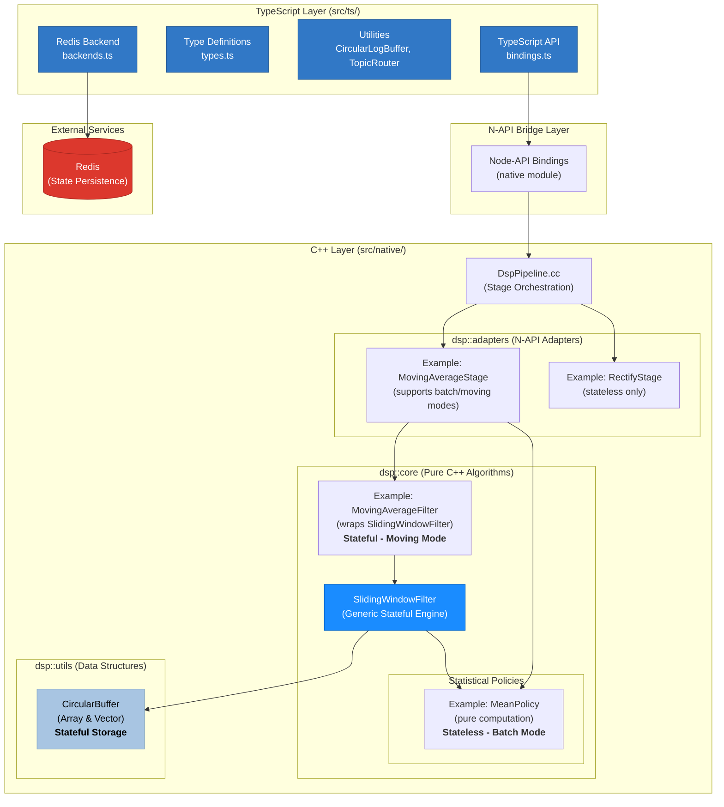

# dspx

[](https://www.npmjs.com/package/dspx)
[](#-quick-start)
[](https://www.typescriptlang.org/)
[](./LICENSE)

> **A production-ready, high-performance DSP library with native C++ acceleration, Redis state persistence, and comprehensive time-series processing. Built for Node.js backends processing real-time biosignals, audio, and sensor data.**

** v1.0.0 Release** Fully tested (606/606 tests passing), battle-tested architecture, comprehensive documentation. Ready for production workloads.

A modern DSP library built for Node.js backends processing real-time biosignals, audio streams, and sensor data. Features native C++ filters with full state serialization to Redis, enabling seamless processing across service restarts and distributed workers.

---

## ✨ Features

- 🚀 **Native C++ Performance** – Optimized circular buffers and filters with SIMD acceleration for real-time processing
- 🎯 **SIMD Acceleration** – AVX2/SSE2/NEON optimizations provide 2-8x speedup on batch operations and rectification
- 🔧 **TypeScript-First** – Full type safety with excellent IntelliSense
- 📡 **Redis State Persistence** – Fully implemented state serialization/deserialization including circular buffer contents and running sums
- 🔥 **Kafka Streaming (Experimental)** – Real-time data ingestion and log streaming via Apache Kafka (testing in progress)
- ⏱️ **Time-Series Processing** – NEW! Support for irregular timestamps and time-based windows
- 🔗 **Fluent Pipeline API** – Chain filter operations with method chaining
- 🎯 **Zero-Copy Processing** – Direct TypedArray manipulation for minimal overhead
- 📊 **Multi-Channel Support** – Process multi-channel signals (EMG, EEG, audio) with independent filter states per channel
- ⚡ **Async Processing** – Background thread processing to avoid blocking the Node.js event loop
- 🛡️ **Crash Recovery** – Resume processing from exact state after service restarts

---

## 🏗️ Architecture

The library uses a layered architecture with clear separation between TypeScript and C++ components:



### Key Architectural Principles

**1. Namespace Separation**

- **`dsp::core`**: Pure C++ algorithms with no Node.js dependencies. Reusable in other C++ projects.
- **`dsp::adapters`**: N-API wrapper classes that expose core algorithms to JavaScript.
- **`dsp::utils`**: Shared data structures (circular buffers) used by core algorithms.

**2. Policy-Based Design (Zero-Cost Abstraction)**

The sliding window filters use **compile-time polymorphism** via template policies:

- **`SlidingWindowFilter<T, Policy>`**: Generic engine handling circular buffer and window logic
- **Statistical Policies**: Define specific computations (MeanPolicy, RmsPolicy, VariancePolicy, etc.)
- **Zero overhead**: Compiler inlines policy methods, achieving hand-written performance
- **Extensibility**: New statistical measures require only a new policy class

Example: `MovingAverageFilter` is a thin wrapper around `SlidingWindowFilter<float, MeanPolicy<float>>`

**2.1 Layered State Management**

State serialization follows a **3-tier delegation pattern** where each layer manages only its own state:

```
Policy Layer        →  getState() returns policy-specific state (running sums, counters, etc.)
      ↓
SlidingWindowFilter →  getState() returns {buffer contents, policy state}
      ↓
Filter Wrapper      →  getState() delegates to SlidingWindowFilter
```

**Example Implementation:**

```cpp
// Policy manages its own statistical state
template <typename T>
struct MeanPolicy {
    T m_sum{};  // Policy-specific state

    auto getState() const -> T { return m_sum; }
    void setState(T sum) { m_sum = sum; }
};

// SlidingWindowFilter coordinates buffer + policy state
template <typename T, typename Policy>
class SlidingWindowFilter {
    auto getState() const {
        return std::make_pair(m_buffer.toVector(), m_policy.getState());
    }

    template <typename PolicyState>
    void setState(const std::vector<T>& bufferData, const PolicyState& policyState) {
        m_buffer.fromVector(bufferData);
        m_policy.setState(policyState);
    }
};

// Filter delegates without knowledge of internals
class MovingAverageFilter {
    auto getState() const { return m_filter.getState(); }  // Clean delegation
};
```

**Benefits:**

- ✅ **Separation of concerns**: Each layer owns its state
- ✅ **Type safety**: Policies can have different state types
- ✅ **Extensibility**: Adding new policies doesn't change SlidingWindowFilter
- ✅ **DRY principle**: No duplicate state assembly code in each filter

**3. Layered Design**

- **TypeScript Layer**: User-facing API, type safety, Redis integration
- **N-API Bridge**: Zero-copy data marshaling between JS and C++
- **C++ Core**: High-performance DSP algorithms with optimized memory management

**4. State Management**

State serialization uses a **layered delegation pattern** (see section 2.1):

- **Policy Layer**: Manages statistical state (running sums, variance accumulators, etc.)
- **SlidingWindowFilter**: Coordinates buffer contents + policy state
- **Filter Wrapper**: Delegates to SlidingWindowFilter without knowledge of internals

Full state serialization to JSON enables:

- ✅ Redis persistence for distributed processing
- ✅ Process continuity across restarts
- ✅ State migration between workers
- ✅ Data integrity validation on deserialization

Each filter's `getState()` returns a tuple `{bufferData: T[], policyState: PolicyState}` that can be JSON-serialized through the TypeScript layer.

**5. Mode Architecture** (MovingAverage, RMS, Variance, ZScoreNormalize)

- **Batch Mode**: Stateless processing, computes over entire input
- **Moving Mode**: Stateful processing with sliding window continuity

This separation enables:

- ✅ Unit testing of C++ algorithms independently
- ✅ Reuse of core DSP code in other projects
- ✅ Type-safe TypeScript API with IntelliSense
- ✅ Zero-copy performance through N-API
- ✅ Distributed processing with Redis state sharing

**6. Native C++ Backend**

- **N-API Bindings**: Direct TypedArray access for zero-copy processing
- **Async Processing**: Uses `Napi::AsyncWorker` to avoid blocking the event loop
- **Optimized Data Structures**: Circular buffers with O(1) operations
- **Template-Based**: Generic implementation supports int, float, double

**7. Redis State Persistence**

The state serialization includes:

- **Circular buffer contents**: All samples in order (oldest to newest)
- **Running sums/squares**: Maintained for O(1) calculations (moving average uses `runningSum`, RMS uses `runningSumOfSquares`)
- **Per-channel state**: Independent state for each audio channel
- **Metadata**: Window size, channel count, timestamps, filter type

**State format examples:**

Moving Average state:

```json
{
  "timestamp": 1761156820,
  "stages": [
    {
      "index": 0,
      "type": "movingAverage",
      "state": {
        "windowSize": 3,
        "numChannels": 1,
        "channels": [
          {
            "buffer": [3, 4, 5],
            "runningSum": 12
          }
        ]
      }
    }
  ],
  "stageCount": 1
}
```

RMS state:

```json
{
  "timestamp": 1761168608,
  "stages": [
    {
      "index": 0,
      "type": "rms",
      "state": {
        "windowSize": 3,
        "numChannels": 1,
        "channels": [
          {
            "buffer": [6, -7, 8],
            "runningSumOfSquares": 149
          }
        ]
      }
    }
  ],
  "stageCount": 1
}
```

**8. Multi-Channel Processing**

Each channel maintains its own independent filter state:

```typescript
// 4-channel interleaved data: [ch1, ch2, ch3, ch4, ch1, ch2, ...]
const input = new Float32Array(4000); // 1000 samples × 4 channels

const pipeline = createDspPipeline();
pipeline.MovingAverage({ windowSize: 50 });

const output = await pipeline.process(input, {
  sampleRate: 2000,
  channels: 4,
});

// Each channel has its own circular buffer and running sum
```

---

## 📊 Comparison with Alternatives

| Feature            | dspx              | scipy/numpy         | dsp.js     | Web Audio API   |
| ------------------ | ----------------- | ------------------- | ---------- | --------------- |
| TypeScript Support | ✅ Native         | ❌ Python-only      | ⚠️ Partial | ✅ Browser-only |
| Performance        | ⚡⚡⚡ Native C++ | ⚡⚡⚡⚡            | ⚡ Pure JS | ⚡⚡⚡          |
| State Persistence  | ✅ Redis          | ❌ Manual           | ❌ None    | ❌ None         |
| Multi-Channel      | ✅ Built-in       | ✅ NumPy arrays     | ⚠️ Limited | ✅ AudioBuffer  |
| Node.js Backend    | ✅ Designed for   | ❌ Context switch   | ✅ Yes     | ❌ Browser      |
| Observability      | ✅ Callbacks      | ❌ Print statements | ❌ None    | ⚠️ Limited      |

---

## 🎯 Is This Library Right For You?

### ✅ Great Fit For:

- Node.js backends processing real-time biosignals (EMG, EEG, ECG)
- Audio streaming services applying filters at scale
- IoT gateways processing sensor data
- Distributed signal processing across multiple workers
- Teams wanting native C++ performance without leaving TypeScript

### ❌ Not Ideal For:

- Browser-only applications (use Web Audio API)
- Python-based ML pipelines (use SciPy/NumPy)
- Hard real-time embedded systems (use bare C/C++)
- Ultra-low latency (<1ms) requirements (Redis adds ~1-5ms)

---

## ⚡ Performance at a Glance

| Operation                        | Throughput       | Production-Ready                  |
| -------------------------------- | ---------------- | --------------------------------- |
| Native processing (no callbacks) | 22M samples/sec  | ✅ Maximum performance            |
| Batched callbacks                | 3.2M samples/sec | ✅ **Recommended** for production |
| Individual callbacks             | 6.1M samples/sec | ⚠️ Development/debugging only     |

**SIMD Acceleration:** Batch operations and rectification are 2-8x faster with AVX2/SSE2/NEON on x86_64. See [SIMD_OPTIMIZATIONS.md](https://github.com/A-KGeorge/dsp_ts_redis/blob/main/docs/SIMD_OPTIMIZATIONS.md) for details.

**Recommendation:** Use batched callbacks in production. Individual callbacks benchmark faster but block the Node.js event loop and can't integrate with real telemetry systems (Kafka, Datadog, Loki).

### ⚠️ ARM/Mobile Platform Notice

**ARM NEON optimizations are experimental.** Mobile/ARM devices face unique challenges:

- **Thermal throttling** - Performance degrades under sustained load
- **Power constraints** - Aggressive frequency scaling impacts benchmarks
- **Memory hierarchy** - Different cache behavior than x86_64 desktop CPUs

**Current Status:**

- ✅ **Moving mode (streaming)** - FIR filters use optimized circular buffers with NEON
- ⚠️ **Batch mode** - May not show speedup vs. scalar code on mobile devices
- ⚠️ **FFT operations** - Naive implementations may outperform native on some ARM chips

**We welcome contributions!** If you have ARM optimization expertise or access to ARM development hardware, please open an issue or PR. Mobile DSP is challenging and community input helps improve real-world performance.

📖 **Read more:** [ARM Platform Status & Performance Notes](https://github.com/A-KGeorge/dsp_ts_redis/blob/main/docs/ARM_PLATFORM_STATUS.md)

---

## 📦 Installation

```bash
npm install dspx redis
```

**Note:** You'll need a C++ compiler if prebuilt binaries aren't available for your platform:

- Windows: Visual Studio 2022 or Build Tools
- macOS: Xcode Command Line Tools
- Linux: GCC/G++ 7+

---

## 🚀 Quick Start

### Basic Usage (Sample-Based)

```typescript
import { createDspPipeline } from "dspx";

// Create a processing pipeline
const pipeline = createDspPipeline();

// Add filters using method chaining
pipeline.MovingAverage({ mode: "moving", windowSize: 100 });

// Process samples (modifies input in-place for performance)
const input = new Float32Array([1, 2, 3, 4, 5, 6, 7, 8, 9, 10]);
const output = await pipeline.process(input, {
  sampleRate: 2000,
  channels: 1,
});

console.log(output); // Smoothed signal
```

### NEW: Time-Series Processing with Timestamps

```typescript
import { createDspPipeline } from "dspx";

// Create a pipeline with time-based window
const pipeline = createDspPipeline();
pipeline.MovingAverage({ mode: "moving", windowDuration: 5000 }); // 5 seconds

// Process data with explicit timestamps (e.g., from IoT sensors with network jitter)
const samples = new Float32Array([1.2, 3.4, 2.1, 4.5, 3.3]);
const timestamps = new Float32Array([0, 100, 250, 400, 500]); // milliseconds

const smoothed = await pipeline.process(samples, timestamps, { channels: 1 });
console.log(smoothed); // Time-aware smoothing
```

**📚 [Complete Time-Series Guide →](https://github.com/A-KGeorge/dsp_ts_redis/blob/main/docs/time-series-guide.md)**

### Processing Without Modifying Input

```typescript
// Use processCopy to preserve the original input
const input = new Float32Array([1, 2, 3, 4, 5]);
const output = await pipeline.processCopy(input, {
  sampleRate: 2000,
  channels: 1,
});

console.log(input); // [1, 2, 3, 4, 5] - unchanged
console.log(output); // [1, 1.5, 2, 3, 4] - smoothed
```

### With Redis State Persistence

```typescript
import { createDspPipeline } from "dspx";
import { createClient } from "redis";

const redis = await createClient({ url: "redis://localhost:6379" }).connect();

// Create pipeline with Redis config
const pipeline = createDspPipeline({
  redisHost: "localhost",
  redisPort: 6379,
  stateKey: "dsp:user123:channel1",
});

pipeline.MovingAverage({ windowSize: 100 });

// Try to restore previous state from Redis
const savedState = await redis.get("dsp:user123:channel1");
if (savedState) {
  await pipeline.loadState(savedState);
  console.log("State restored!");
}

// Process data - filter state is maintained
await pipeline.process(chunk1, { sampleRate: 2000, channels: 1 });

// Save state to Redis (includes circular buffer contents!)
const state = await pipeline.saveState();
await redis.set("dsp:user123:channel1", state);

// Continue processing - even after service restart!
await pipeline.process(chunk2, { sampleRate: 2000, channels: 1 });

// Clear state when starting fresh
pipeline.clearState();
```

### With Kafka Streaming (Experimental)

> ⚠️ **Note:** Kafka integration is experimental and requires additional testing. See the [Contributing](#-contributing) section if you'd like to help!

```typescript
import { createDspPipeline, createKafkaConsumer } from "dspx";

// Create DSP pipeline
const pipeline = createDspPipeline();
pipeline
  .MovingAverage({ mode: "moving", windowSize: 10 })
  .Rms({ mode: "moving", windowSize: 5 });

// Consume sensor data from Kafka topic
const consumer = await createKafkaConsumer({
  brokers: ["localhost:9092"],
  groupId: "dsp-processors",
  topics: ["sensor-data"],
  onMessage: async ({ value }) => {
    const samples = new Float32Array(value.data);
    const output = await pipeline.process(samples, {
      channels: 1,
      sampleRate: 44100,
    });
    console.log("Processed:", output[0]);
  },
});

await consumer.run();
```

**See [Kafka Integration Guide](https://github.com/A-KGeorge/dsp_ts_redis/blob/main/docs/KAFKA_INTEGRATION.md) for real-time streaming examples.**

### Multi-Channel Processing

```typescript
import { createDspPipeline } from "dspx";

const pipeline = createDspPipeline();
pipeline.MovingAverage({ windowSize: 50 });

// Process 4-channel EMG data
// Data format: [ch1_s1, ch2_s1, ch3_s1, ch4_s1, ch1_s2, ch2_s2, ...]
const fourChannelData = new Float32Array(4000); // 1000 samples × 4 channels

const output = await pipeline.process(fourChannelData, {
  sampleRate: 2000,
  channels: 4, // Each channel maintains its own filter state
});

// Each channel is processed independently with its own circular buffer
```

---

## 🔗 API Reference

### Creating a Pipeline

```typescript
import { createDspPipeline, type RedisConfig } from "dspx";

interface RedisConfig {
  redisHost?: string;   // Redis server hostname (optional)
  redisPort?: number;   // Redis server port (optional)
  stateKey?: string;    // Key prefix for state storage (optional)
}

const pipeline = createDspPipeline(config?: RedisConfig);
```

### Process Methods

The library supports three processing modes:

```typescript
// Mode 1: Legacy sample-based (auto-generates timestamps from sample rate)
await pipeline.process(samples: Float32Array, options: {
  sampleRate: number;  // Hz (required for timestamp generation)
  channels: number;
});

// Mode 2: Time-based with explicit timestamps
await pipeline.process(samples: Float32Array, timestamps: Float32Array, options: {
  channels: number;    // sampleRate not needed
});

// Mode 3: Auto-sequential (no sample rate, generates [0,1,2,3,...])
await pipeline.process(samples: Float32Array, options: {
  channels: number;    // sampleRate omitted
});
```

**See [Time-Series Guide](https://github.com/A-KGeorge/dsp_ts_redis/blob/main/docs/time-series-guide.md) for detailed examples.**

### Available Filters

#### Currently Implemented

##### Moving Average Filter

```typescript
// Batch Mode - Stateless, computes average over entire input
pipeline.MovingAverage({ mode: "batch" });

// Moving Mode - Stateful, sliding window with continuity
pipeline.MovingAverage({ mode: "moving", windowSize: number });

// NEW: Time-Based Window
pipeline.MovingAverage({ mode: "moving", windowDuration: number }); // milliseconds
```

Implements a simple moving average (SMA) filter with two modes:

**Modes:**

| Mode       | Description                        | State     | Output                                      | Use Case                            |
| ---------- | ---------------------------------- | --------- | ------------------------------------------- | ----------------------------------- |
| `"batch"`  | Computes average over entire input | Stateless | All samples have same value (mean of input) | Quality metrics, summary statistics |
| `"moving"` | Sliding window across samples      | Stateful  | Each sample smoothed by window              | Real-time smoothing, trend analysis |

**Parameters:**

- `mode`: `"batch"` or `"moving"` - determines computation strategy
- `windowSize`: Number of samples to average over **(optional for moving mode)**
- `windowDuration`: Time-based window in milliseconds **(optional for moving mode)**
- At least one of `windowSize` or `windowDuration` must be specified for moving mode

**Features:**

- **Batch mode**: O(n) computation, no state between calls
- **Moving mode**: O(1) per sample with circular buffer and running sum
- Per-channel state for multi-channel processing
- Full state serialization to Redis

**Example:**

```typescript
// Batch mode: Average of [1,2,3,4,5] = 3
const batch = createDspPipeline().MovingAverage({ mode: "batch" });
const result1 = await batch.process(new Float32Array([1, 2, 3, 4, 5]));
// result1 = [3, 3, 3, 3, 3]

// Moving mode: Window size 3
const moving = createDspPipeline().MovingAverage({
  mode: "moving",
  windowSize: 3,
});
const result2 = await moving.process(new Float32Array([1, 2, 3, 4, 5]));
// result2 = [1, 1.5, 2, 3, 4] (sliding window averages)
```

**Use cases:**

- **Batch**: Quality control metrics, batch statistics, data summarization
- **Moving**: Signal smoothing, noise reduction, trend analysis, low-pass filtering

##### Convolution Filter

```typescript
// Batch Mode - Process entire buffer with kernel
pipeline.Convolution({ mode: "batch", kernel: Float32Array });

// Moving Mode - Stateful streaming convolution
pipeline.Convolution({
  mode: "moving",
  kernel: Float32Array,
  method: "auto" | "direct" | "fft", // auto (default): switches at kernel size 64
});
```

Implements high-performance 1D convolution with automatic FFT acceleration for large kernels. Supports arbitrary kernels for filtering, edge detection, feature extraction, and more.

**Modes:**

| Mode       | Description                        | State     | Output                            | Use Case                                 |
| ---------- | ---------------------------------- | --------- | --------------------------------- | ---------------------------------------- |
| `"batch"`  | Convolve kernel with entire buffer | Stateless | Full convolution of input         | Offline processing, batch filtering      |
| `"moving"` | Stateful streaming convolution     | Stateful  | Overlap-add with state continuity | Real-time filtering, streaming workloads |

**Parameters:**

- `mode`: `"batch"` or `"moving"` - determines computation strategy
- `kernel`: Float32Array - convolution kernel/filter coefficients
- `method` (optional): `"auto"` (default), `"direct"`, or `"fft"`
  - `"auto"`: Uses direct SIMD for kernel ≤ 64, FFT for kernel > 64
  - `"direct"`: Always use direct convolution (SIMD-accelerated)
  - `"fft"`: Always use FFT-based convolution (overlap-add for moving mode)

**Features:**

- **Automatic FFT acceleration**: Auto-switches at kernel size 64 for optimal performance
- **SIMD optimization**: AVX2/SSE2 accelerated direct convolution (4-8x throughput)
- **Zero allocations**: Pre-allocated buffers eliminate per-call overhead
- **Cache-friendly**: De-interleaved processing for multi-channel signals
- **Overlap-add**: Efficient chunked processing for moving mode FFT
- **Per-channel state**: Independent convolution state for each channel

**Performance Characteristics (Moving Mode):**

| Kernel Size | Method Used   | Throughput (samples/sec) | vs Naive JS                             |
| ----------- | ------------- | ------------------------ | --------------------------------------- |
| K=8         | Direct (SIMD) | ~19M                     | Naive JS faster (110M) - see note below |
| K=32        | Direct (SIMD) | ~12M                     | Naive JS faster (36M) - see note below  |
| K=64        | Direct (SIMD) | ~7M                      | Naive JS faster (18M) - threshold point |
| K=128       | FFT (overlap) | **82M**                  | **8.5x faster** than naive JS (9.6M)    |
| K=256       | FFT (overlap) | **77M**                  | **15x faster** than naive JS (5M)       |

**Example:**

```typescript
// Batch mode: Simple edge detection kernel
const edgeKernel = new Float32Array([-1, 0, 1]); // Horizontal gradient
const batch = createDspPipeline().Convolution({
  mode: "batch",
  kernel: edgeKernel,
});
const edges = await batch.process(signal);

// Moving mode: Gaussian smoothing (auto FFT for K=7)
const gaussianKernel = new Float32Array([0.06, 0.24, 0.4, 0.24, 0.06]);
const moving = createDspPipeline().Convolution({
  mode: "moving",
  kernel: gaussianKernel,
  method: "auto", // Uses direct SIMD (K < 64)
});
const smoothed = await moving.process(noisySignal);

// Large kernel: Automatic FFT acceleration (K=128)
const largeKernel = new Float32Array(128).fill(1 / 128); // Moving average K=128
const fftConv = createDspPipeline().Convolution({
  mode: "moving",
  kernel: largeKernel,
  method: "auto", // Auto-switches to FFT for 9x speedup
});
const filtered = await fftConv.process(data);
```

**Use Cases:**

- **Signal Processing**: Custom FIR filters, bandpass/bandstop filters, matched filtering
- **Computer Vision**: Edge detection (Sobel, Prewitt), Gaussian blur, sharpening
- **Feature Extraction**: Wavelet convolution, pattern matching, template detection
- **Audio Processing**: Impulse response convolution, reverb, echo effects
- **Time Series**: Smoothing, differentiation, integration kernels

**Mathematical Properties:**

- **Linearity**: Conv(a·x₁ + b·x₂, h) = a·Conv(x₁, h) + b·Conv(x₂, h)
- **Commutative**: x ⊛ h = h ⊛ x
- **Associative**: (x ⊛ h₁) ⊛ h₂ = x ⊛ (h₁ ⊛ h₂)
- **FFT Equivalence**: Time-domain convolution = Frequency-domain multiplication

##### RMS (Root Mean Square) Filter

```typescript
// Batch Mode - Stateless, computes RMS over entire input
pipeline.Rms({ mode: "batch" });

// Moving Mode - Stateful, sliding window with continuity
pipeline.Rms({ mode: "moving", windowSize: number });
```

Implements an efficient RMS filter with two modes:

**Modes:**

| Mode       | Description                    | State     | Output                                     | Use Case                            |
| ---------- | ------------------------------ | --------- | ------------------------------------------ | ----------------------------------- |
| `"batch"`  | Computes RMS over entire input | Stateless | All samples have same value (RMS of input) | Power measurement, batch analysis   |
| `"moving"` | Sliding window across samples  | Stateful  | Each sample is RMS of window               | Envelope detection, real-time power |

**Parameters:**

- `mode`: `"batch"` or `"moving"` - determines computation strategy
- `windowSize`: Number of samples to calculate RMS over **(required for moving mode only)**

**Features:**

- **Batch mode**: O(n) computation, no state between calls
- **Moving mode**: O(1) per sample with circular buffer and running sum of squares
- Per-channel state for multi-channel processing
- Full state serialization to Redis
- Always positive output (magnitude-based)

**Example:**

```typescript
// Batch mode: RMS of [1, -2, 3, -4, 5] = sqrt((1² + 4 + 9 + 16 + 25)/5) = 3.31
const batch = createDspPipeline().Rms({ mode: "batch" });
const result1 = await batch.process(new Float32Array([1, -2, 3, -4, 5]));
// result1 = [3.31, 3.31, 3.31, 3.31, 3.31]

// Moving mode: Window size 3
const moving = createDspPipeline().Rms({ mode: "moving", windowSize: 3 });
const result2 = await moving.process(new Float32Array([1, -2, 3, -4, 5]));
// result2 = [1.0, 1.58, 2.16, 3.11, 4.08] - sliding window RMS
```

**Use cases:**

- **Batch**: Overall signal power, quality metrics, batch statistics
- **Moving**: Signal envelope detection, amplitude tracking, power measurement, feature extraction

##### Mean Absolute Value (MAV) Filter

```typescript
// Batch Mode - Stateless, computes MAV over entire input
pipeline.MeanAbsoluteValue({ mode: "batch" });

// Moving Mode - Stateful, sliding window with continuity
pipeline.MeanAbsoluteValue({ mode: "moving", windowSize: number });
```

Implements an efficient Mean Absolute Value filter with two modes - commonly used in EMG signal analysis for muscle activity quantification.

**Modes:**

| Mode       | Description                    | State     | Output                                     | Use Case                                 |
| ---------- | ------------------------------ | --------- | ------------------------------------------ | ---------------------------------------- |
| `"batch"`  | Computes MAV over entire input | Stateless | All samples have same value (MAV of input) | Global activity level, batch analysis    |
| `"moving"` | Sliding window across samples  | Stateful  | Each sample is MAV of window               | Real-time activity detection, transients |

**Parameters:**

- `mode`: `"batch"` or `"moving"` - determines computation strategy
- `windowSize`: Number of samples to calculate MAV over **(required for moving mode only)**

**Features:**

- **Batch mode**: O(n) computation, no state between calls
- **Moving mode**: O(1) per sample with circular buffer and running sum of absolute values
- Per-channel state for multi-channel EMG processing
- Full state serialization to Redis
- Always non-negative output
- Scale-invariant: MAV(k·x) = k·MAV(x)

**Example:**

```typescript
// Batch mode: MAV of [1, -2, 3, -4, 5] = (|1| + |-2| + |3| + |-4| + |5|)/5 = 3.0
const batch = createDspPipeline().MeanAbsoluteValue({ mode: "batch" });
const result1 = await batch.process(new Float32Array([1, -2, 3, -4, 5]));
// result1 = [3.0, 3.0, 3.0, 3.0, 3.0]

// Moving mode: Window size 3
const moving = createDspPipeline().MeanAbsoluteValue({
  mode: "moving",
  windowSize: 3,
});
const result2 = await moving.process(new Float32Array([1, -2, 3, -4, 5]));
// result2 = [1.0, 1.5, 2.0, 3.0, 4.0] - sliding window MAV
```

**Use cases:**

- **EMG Analysis**: Muscle activity quantification, fatigue detection, gesture recognition
- **Vibration Monitoring**: Equipment health monitoring, anomaly detection
- **Audio Processing**: Envelope detection, dynamic range analysis
- **Batch**: Overall signal activity level, quality metrics
- **Moving**: Real-time transient detection, activity onset/offset detection, prosthetic control

**Mathematical Properties:**

- **Non-negative**: MAV(x) ≥ 0 for all signals
- **Scale-invariant**: MAV(k·x) = k·MAV(x)
- **Bounded**: MAV(x) ≤ max(|x|) for any window
- **Reduces to mean**: For all positive signals, MAV = mean

##### Rectify Filter

```typescript
pipeline.Rectify(params?: { mode?: "full" | "half" });
```

Implements signal rectification with two modes: full-wave (absolute value) and half-wave (zero out negatives). Stateless operation with no internal buffers.

**Parameters:**

- `mode` (optional): Rectification mode
  - `"full"` (default): Full-wave rectification (absolute value) - converts all samples to positive
  - `"half"`: Half-wave rectification - positive samples unchanged, negative samples → 0

**Features:**

- Zero overhead - simple sample-by-sample transformation
- No internal state/buffers (stateless)
- Mode is serializable for pipeline persistence
- Works independently on each sample (no windowing)

**Use cases:**

- EMG signal pre-processing before envelope detection
- AC to DC conversion in audio/biosignal processing
- Preparing signals for RMS or moving average smoothing
- Feature extraction requiring positive-only values

**Examples:**

```typescript
// Full-wave rectification (default) - converts to absolute value
const pipeline1 = createDspPipeline();
pipeline1.Rectify(); // or Rectify({ mode: "full" })

const bipolar = new Float32Array([1, -2, 3, -4, 5]);
const fullWave = await pipeline1.process(bipolar, {
  sampleRate: 1000,
  channels: 1,
});
console.log(fullWave); // [1, 2, 3, 4, 5] - all positive

// Half-wave rectification - zeros out negatives
const pipeline2 = createDspPipeline();
pipeline2.Rectify({ mode: "half" });

const halfWave = await pipeline2.process(new Float32Array([1, -2, 3, -4, 5]), {
  sampleRate: 1000,
  channels: 1,
});
console.log(halfWave); // [1, 0, 3, 0, 5] - negatives become zero

// Common pipeline: Rectify → RMS for EMG envelope
const emgPipeline = createDspPipeline();
emgPipeline
  .Rectify({ mode: "full" }) // Convert to magnitude
  .Rms({ windowSize: 50 }); // Calculate envelope
```

##### Variance Filter

```typescript
pipeline.Variance(params: { mode: "batch" | "moving"; windowSize?: number });
```

Implements variance calculation to measure data spread and variability. Supports both stateless batch variance and stateful moving variance with a sliding window.

**Parameters:**

- `mode`: Variance calculation mode
  - `"batch"`: Stateless - computes variance over entire batch, all output samples contain the same value
  - `"moving"`: Stateful - computes variance over a sliding window, maintains state across process() calls
- `windowSize`: Required for `"moving"` mode - size of the sliding window

**Features:**

- **Batch mode**: O(1) space complexity, processes entire batch in two passes
- **Moving mode**: O(1) per-sample computation using circular buffer with running sums
- Maintains running sum and running sum of squares for efficient calculation
- Per-channel state for multi-channel processing
- Full state serialization to Redis including buffer contents and running values
- Variance is always non-negative (uses max(0, calculated) to handle floating-point errors)

**Mathematical Note:**

Variance is calculated as: `Var(X) = E[X²] - (E[X])²`

Where:

- `E[X]` is the mean (average) of values
- `E[X²]` is the mean of squared values

**Use cases:**

- Signal quality monitoring (detect signal stability)
- Anomaly detection (identify unusual variability)
- Feature extraction for machine learning (EMG, EEG analysis)
- Real-time variability tracking in biosignals
- Data consistency validation in sensor streams

**Examples:**

```typescript
// Batch variance - stateless, entire batch → single variance value
const pipeline1 = createDspPipeline();
pipeline1.Variance({ mode: "batch" });

const data = new Float32Array([1, 2, 3, 4, 5]);
const output1 = await pipeline1.process(data, {
  sampleRate: 1000,
  channels: 1,
});
console.log(output1); // [2, 2, 2, 2, 2] - all values are the batch variance

// Moving variance - stateful, sliding window
const pipeline2 = createDspPipeline();
pipeline2.Variance({ mode: "moving", windowSize: 3 });

const output2 = await pipeline2.process(data, {
  sampleRate: 1000,
  channels: 1,
});
console.log(output2);
// [0, 0.25, 0.67, 0.67, 0.67] - variance evolves as window slides
// Window: [1] → [1,2] → [1,2,3] → [2,3,4] → [3,4,5]

// EMG variability monitoring pipeline
const emgPipeline = createDspPipeline()
  .Rectify({ mode: "full" }) // Convert to magnitude
  .Variance({ mode: "moving", windowSize: 100 }); // Track variability

// Multi-channel signal quality monitoring
const qualityPipeline = createDspPipeline().Variance({ mode: "batch" });

const fourChannelData = new Float32Array(4000); // 1000 samples × 4 channels
const variances = await qualityPipeline.process(fourChannelData, {
  sampleRate: 2000,
  channels: 4,
});
// Each channel gets its own variance value
```

**Batch vs Moving Mode:**

| Mode     | State     | Output                        | Use Case                       |
| -------- | --------- | ----------------------------- | ------------------------------ |
| `batch`  | Stateless | All samples = single variance | Per-chunk quality assessment   |
| `moving` | Stateful  | Variance per sample (sliding) | Real-time variability tracking |

**Performance:**

- Batch mode: Two-pass algorithm (sum calculation, then variance), O(n) time
- Moving mode: Single-pass with circular buffer, O(1) per sample after warmup
- State persistence includes full circular buffer + running sums (can be large for big windows)

##### Z-Score Normalization Filter

```typescript
pipeline.ZScoreNormalize(params: {
  mode: "batch" | "moving";
  windowSize?: number;
  epsilon?: number;
});
```

Implements Z-Score normalization to standardize data to have mean 0 and standard deviation 1. Supports both stateless batch normalization and stateful moving normalization with a sliding window.

**Z-Score Formula:** `(Value - Mean) / StandardDeviation`

**Parameters:**

- `mode`: Normalization calculation mode
  - `"batch"`: Stateless - computes mean and stddev over entire batch, normalizes all samples
  - `"moving"`: Stateful - computes mean and stddev over sliding window, maintains state across process() calls
- `windowSize`: Required for `"moving"` mode - size of the sliding window
- `epsilon`: Small value to prevent division by zero when standard deviation is 0 (default: `1e-6`)

**Features:**

- **Batch mode**: Normalizes entire dataset to mean=0, stddev=1 using global statistics
- **Moving mode**: Adaptive normalization using local window statistics
- Maintains running sum and running sum of squares for O(1) mean/stddev calculation
- Per-channel state for multi-channel processing
- Full state serialization including buffer contents and running values
- Epsilon handling prevents NaN when processing constant signals

**Use cases:**

- Machine learning preprocessing (feature standardization)
- Anomaly detection (outlier identification using ±3σ thresholds)
- Neural network input normalization
- EEG/EMG signal standardization for multi-channel processing
- Real-time data stream normalization with adaptive statistics
- Removing baseline drift and amplitude variations

**Examples:**

```typescript
// Batch normalization - standardize entire dataset
const pipeline1 = createDspPipeline();
pipeline1.ZScoreNormalize({ mode: "batch" });

const data = new Float32Array([10, 20, 30, 40, 50]);
const output1 = await pipeline1.process(data, {
  sampleRate: 1000,
  channels: 1,
});
// All samples normalized to mean=0, stddev=1
// Output: [-1.414, -0.707, 0, 0.707, 1.414] (approximately)

// Moving normalization - adaptive standardization
const pipeline2 = createDspPipeline();
pipeline2.ZScoreNormalize({ mode: "moving", windowSize: 50 });

const streamData = new Float32Array(200); // Continuous stream
const output2 = await pipeline2.process(streamData, {
  sampleRate: 1000,
  channels: 1,
});
// Each sample normalized using local window statistics
// Adapts to changes in mean and variance over time

// Anomaly detection with z-score thresholds
const pipeline3 = createDspPipeline();
pipeline3.ZScoreNormalize({ mode: "moving", windowSize: 100 });

const sensorData = new Float32Array(500);
const zScores = await pipeline3.process(sensorData, {
  sampleRate: 100,
  channels: 1,
});

// Detect outliers (z-score > ±3 indicates anomaly)
const anomalies = [];
for (let i = 0; i < zScores.length; i++) {
  if (Math.abs(zScores[i]) > 3.0) {
    anomalies.push({ index: i, zScore: zScores[i] });
  }
}

// Multi-channel EEG normalization
const eegPipeline = createDspPipeline();
eegPipeline.ZScoreNormalize({ mode: "moving", windowSize: 128 });

const fourChannelEEG = new Float32Array(2048); // 512 samples × 4 channels
const normalizedEEG = await eegPipeline.process(fourChannelEEG, {
  sampleRate: 256,
  channels: 4,
});
// Each EEG channel independently normalized to mean=0, stddev=1

// Custom epsilon for near-constant signals
const pipeline4 = createDspPipeline();
pipeline4.ZScoreNormalize({ mode: "batch", epsilon: 0.1 });

const nearConstant = new Float32Array([5.0, 5.001, 4.999, 5.0]);
const output4 = await pipeline4.process(nearConstant, {
  sampleRate: 1000,
  channels: 1,
});
// When stddev < epsilon, output is 0 (prevents division by tiny numbers)
```

**Batch vs Moving Mode:**

| Mode     | State     | Output                                          | Use Case                                            |
| -------- | --------- | ----------------------------------------------- | --------------------------------------------------- |
| `batch`  | Stateless | All samples normalized using global mean/stddev | ML preprocessing, dataset standardization           |
| `moving` | Stateful  | Each sample normalized using local window stats | Real-time anomaly detection, adaptive normalization |

**Performance:**

- Batch mode: Two-pass algorithm (calculate mean, then stddev, then normalize), O(n) time
- Moving mode: Single-pass with circular buffer, O(1) per sample after warmup
- Anomaly detection: O(1) threshold comparison after normalization
- State persistence includes full circular buffer + running sums

**Mathematical Properties:**

- Normalized data has mean = 0 (centered)
- Normalized data has standard deviation = 1 (scaled)
- Z-scores > ±3 represent outliers (>99.7% of data within ±3σ in normal distribution)
- Preserves relative distances and relationships in the data
- Linear transformation (reversible if original mean/stddev are known)

##### Waveform Length (WL) Filter

```typescript
pipeline.WaveformLength({ windowSize: number });
```

Implements waveform length calculation to measure the total path length traveled by a signal over a sliding window. WL is the sum of absolute differences between consecutive samples, commonly used in EMG signal analysis.

**Parameters:**

- `windowSize`: Number of samples for the sliding window

**Features:**

- O(1) per-sample computation using circular buffer with running sum of differences
- Tracks previous sample to calculate absolute difference
- Per-channel state for multi-channel EMG processing
- Full state serialization including buffer and previous sample value
- Always non-negative output
- Sensitive to signal complexity and frequency content

**Mathematical Definition:**

For window of samples `[x₁, x₂, ..., xₙ]`:
`WL = Σ|xᵢ₊₁ - xᵢ|` for i = 1 to n-1

**Use cases:**

- EMG signal analysis and muscle activity quantification
- Detecting signal complexity and variability
- Gesture recognition and prosthetic control
- Fatigue detection (WL decreases with muscle fatigue)
- Feature extraction for classification algorithms
- Vibration monitoring and equipment diagnostics

**Example:**

```typescript
// Basic waveform length computation
const pipeline = createDspPipeline();
pipeline.WaveformLength({ windowSize: 100 });

const signal = new Float32Array([1, 3, 2, 5, 4, 6]);
// Differences: |3-1|=2, |2-3|=1, |5-2|=3, |4-5|=1, |6-4|=2
// Cumulative WL: 0, 2, 3, 6, 7, 9
const result = await pipeline.process(signal, {
  sampleRate: 1000,
  channels: 1,
});
// result = [0, 2, 3, 6, 7, 9]

// EMG feature extraction pipeline
const emgPipeline = createDspPipeline();
emgPipeline
  .Rectify({ mode: "full" }) // Convert to magnitude
  .WaveformLength({ windowSize: 250 }); // 250ms window at 1kHz

// Multi-channel muscle monitoring
const multiChannelEMG = new Float32Array(4000); // 1000 samples × 4 channels
const wlFeatures = await emgPipeline.process(multiChannelEMG, {
  sampleRate: 1000,
  channels: 4,
});
// Each muscle gets independent WL calculation
```

**Comparison with other features:**

| Feature | Measures                    | Sensitivity        | Use Case               |
| ------- | --------------------------- | ------------------ | ---------------------- |
| WL      | Total path length           | High to complexity | Complexity/variability |
| MAV     | Average magnitude           | Amplitude level    | Activity level         |
| RMS     | Root mean square            | Power/energy       | Signal strength        |
| SSC     | Slope direction changes     | Frequency content  | Oscillation rate       |
| WAMP    | Amplitude threshold crosses | Burst detection    | Transient events       |

**Mathematical Properties:**

- **Non-negative**: WL ≥ 0 for all signals
- **Monotonic**: WL increases with window filling
- **Frequency-dependent**: Higher frequency → higher WL for same amplitude
- **Scale-variant**: WL(k·x) = k·WL(x) for constant k

##### Slope Sign Change (SSC) Filter

```typescript
pipeline.SlopeSignChange({ windowSize: number; threshold?: number });
```

Implements slope sign change counting to measure frequency content by detecting how many times the signal changes direction (slope changes from positive to negative or vice versa). Commonly used in EMG analysis.

**Parameters:**

- `windowSize`: Number of samples for the sliding window
- `threshold`: Minimum absolute difference to count as significant (default: 0)

**Features:**

- Counts direction changes (increasing→decreasing or decreasing→increasing)
- Threshold filtering to ignore noise and minor fluctuations
- Requires 2 previous samples for slope calculation
- O(1) per-sample computation using circular buffer
- Per-channel state for multi-channel processing
- Full state serialization including filter state (previous 2 samples, init count)

**Mathematical Definition:**

A slope sign change occurs at sample `xᵢ` if:
`[(xᵢ - xᵢ₋₁) × (xᵢ - xᵢ₊₁)] ≥ threshold²`

Where `xᵢ₋₁` and `xᵢ₊₁` are the previous and next samples.

**Use cases:**

- EMG frequency content analysis
- Detecting oscillations and vibrations
- Gesture recognition based on movement patterns
- Signal complexity measurement
- Muscle contraction rate estimation
- Feature extraction for pattern recognition

**Example:**

```typescript
// Basic SSC with zero threshold
const pipeline = createDspPipeline();
pipeline.SlopeSignChange({ windowSize: 100, threshold: 0 });

const signal = new Float32Array([1, 3, 2, 4, 3, 5]);
// Slopes: + - + - +
// Sign changes at indices: 2, 3, 4, 5
const result = await pipeline.process(signal, {
  sampleRate: 1000,
  channels: 1,
});
// result = [0, 0, 1, 2, 3, 4]

// SSC with noise threshold
const filteredPipeline = createDspPipeline();
filteredPipeline.SlopeSignChange({ windowSize: 200, threshold: 0.1 });

const noisySignal = new Float32Array(500);
// Only counts sign changes where |difference| > 0.1
const sscCount = await filteredPipeline.process(noisySignal, {
  sampleRate: 1000,
  channels: 1,
});

// Multi-channel EMG analysis
const emgPipeline = createDspPipeline();
emgPipeline
  .Rectify({ mode: "full" })
  .SlopeSignChange({ windowSize: 250, threshold: 0.05 });

const fourChannelEMG = new Float32Array(4000);
const sscFeatures = await emgPipeline.process(fourChannelEMG, {
  sampleRate: 1000,
  channels: 4,
});
```

**Interpretation:**

- **Low SSC**: Smooth, slow-changing signal (low frequency)
- **High SSC**: Rapidly oscillating signal (high frequency)
- **Zero SSC**: Monotonic signal (constantly increasing or decreasing)
- **Threshold effect**: Higher threshold → fewer counted changes (filters noise)

**Mathematical Properties:**

- **Integer-valued**: SSC is always a whole number (count)
- **Non-negative**: SSC ≥ 0
- **Bounded**: Max SSC = window_size - 2 (alternating signal)
- **Frequency proxy**: Approximately proportional to signal frequency

##### Willison Amplitude (WAMP) Filter

```typescript
pipeline.WillisonAmplitude({ windowSize: number; threshold?: number });
```

Implements Willison Amplitude calculation to count the number of times the absolute difference between consecutive samples exceeds a threshold. Useful for detecting burst activity and transient events in EMG signals.

**Parameters:**

- `windowSize`: Number of samples for the sliding window
- `threshold`: Minimum absolute difference to count as significant (default: 0)

**Features:**

- Counts amplitude changes exceeding threshold
- Tracks previous sample for difference calculation
- O(1) per-sample computation using circular buffer
- Per-channel state for multi-channel processing
- Full state serialization including buffer and previous sample
- Sensitive to amplitude variations and burst activity

**Mathematical Definition:**

WAMP counts samples where:
`|xᵢ - xᵢ₋₁| > threshold`

Where `xᵢ` is the current sample and `xᵢ₋₁` is the previous sample.

**Use cases:**

- EMG burst detection and muscle activation counting
- Transient event detection in sensor data
- Activity level quantification
- Feature extraction for gesture recognition
- Equipment vibration monitoring
- Signal quality assessment (detect dropouts/spikes)

**Example:**

```typescript
// Basic WAMP with threshold
const pipeline = createDspPipeline();
pipeline.WillisonAmplitude({ windowSize: 100, threshold: 1.0 });

const signal = new Float32Array([0, 0.5, 2.5, 2.6, 1.0, 3.5]);
// Diffs: 0.5, 2.0, 0.1, -1.6, 2.5
// Exceeds: no, yes, no, yes, yes
const result = await pipeline.process(signal, {
  sampleRate: 1000,
  channels: 1,
});
// result = [0, 0, 1, 1, 2, 3]

// EMG burst detection
const burstPipeline = createDspPipeline();
burstPipeline
  .Rectify({ mode: "full" })
  .WillisonAmplitude({ windowSize: 200, threshold: 0.1 });

const emgData = new Float32Array(1000);
const burstCount = await burstPipeline.process(emgData, {
  sampleRate: 1000,
  channels: 1,
});
// High WAMP values indicate burst activity

// Multi-channel activity monitoring
const activityPipeline = createDspPipeline();
activityPipeline.WillisonAmplitude({ windowSize: 250, threshold: 0.05 });

const multiChannelData = new Float32Array(4000); // 4 channels
const activityLevel = await activityPipeline.process(multiChannelData, {
  sampleRate: 1000,
  channels: 4,
});
// Each channel independently tracks activity bursts
```

**Interpretation:**

- **Low WAMP**: Smooth signal with gradual changes
- **High WAMP**: Signal with frequent amplitude variations or bursts
- **Zero WAMP**: Constant signal or all changes below threshold
- **Threshold effect**: Higher threshold → fewer counted events

**Comparison with SSC:**

| Feature | Measures          | Sensitivity            | Best For              |
| ------- | ----------------- | ---------------------- | --------------------- |
| WAMP    | Amplitude changes | Large amplitude shifts | Burst detection       |
| SSC     | Direction changes | Frequency content      | Oscillation counting  |
| Both    | Signal activity   | Different aspects      | Combined EMG features |

**Mathematical Properties:**

- **Integer-valued**: WAMP is a count (whole number)
- **Non-negative**: WAMP ≥ 0
- **Bounded**: Max WAMP = window_size - 1 (all samples exceed threshold)
- **Threshold-dependent**: WAMP decreases as threshold increases

#### 🚧 Coming Very Soon

**Resampling Operations** (Expected in next few days):

- **`Decimate`**: Downsample by integer factor M with anti-aliasing filter
- **`Interpolate`**: Upsample by integer factor L with anti-imaging filter
- **`Resample`**: Rational resampling (L/M) for arbitrary rate conversion
- All implemented with efficient polyphase FIR filtering in C++

**Other Planned Features:**

- **Transform Domain**: STFT, Hilbert transform, wavelet transforms
- **Feature Extraction**: Zero-crossing rate, peak detection, autocorrelation

See the [project roadmap](https://github.com/A-KGeorge/dsp_ts_redis/blob/main/ROADMAP.md) for more details.

---

## 🔧 Advanced Features

For production deployments, the library provides comprehensive observability and monitoring capabilities:

### Available Features

- **Pipeline Callbacks** - Monitor performance, errors, and samples with batched or individual callbacks
- **Topic-Based Logging** - Kafka-style hierarchical filtering for selective log subscription
- **Topic Router** - Fan-out routing to multiple backends (PagerDuty, Prometheus, Loki, etc.)
- **Priority-Based Routing** - 10-level priority system for fine-grained log filtering
- **`.tap()` Debugging** - Inspect intermediate pipeline results without breaking the flow

### Quick Example

```typescript
import { createDspPipeline, createTopicRouter } from "dspx";

// Production-grade routing to multiple backends
const router = createTopicRouter()
  .errors(async (log) => await pagerDuty.alert(log))
  .performance(async (log) => await prometheus.record(log))
  .debug(async (log) => await loki.send(log))
  .build();

const pipeline = createDspPipeline()
  .pipeline({ onLogBatch: (logs) => router.routeBatch(logs) })
  .MovingAverage({ windowSize: 10 })
  .Rms({ windowSize: 5 });
```

**📚 [Full Advanced Features Documentation](https://github.com/A-KGeorge/dsp_ts_redis/blob/main/docs/advanced.md)**

Key highlights:

- Batched callbacks: **3.2M samples/sec** (production-safe, non-blocking)
- Individual callbacks: **6.1M samples/sec** (development only, blocks event loop)
- Native processing: **22M samples/sec** (no callbacks)

---

### Core Methods

#### `process(input, options)`

Process data in-place (modifies input buffer for performance):

```typescript
const input = new Float32Array([1, 2, 3, 4, 5]);
const output = await pipeline.process(input, {
  sampleRate: 2000,
  channels: 1,
});
// input === output (same reference)
```

#### `processCopy(input, options)`

Process a copy of the data (preserves original):

```typescript
const input = new Float32Array([1, 2, 3, 4, 5]);
const output = await pipeline.processCopy(input, {
  sampleRate: 2000,
  channels: 1,
});
// input !== output (different references)
```

#### `saveState()`

Serialize the current pipeline state to JSON:

```typescript
const stateJson = await pipeline.saveState();
// Returns: JSON string with all filter states
await redis.set("dsp:state:key", stateJson);
```

#### `loadState(stateJson)`

Deserialize and restore pipeline state from JSON:

```typescript
const stateJson = await redis.get("dsp:state:key");
if (stateJson) {
  await pipeline.loadState(stateJson);
}
```

#### `clearState()`

Reset all filter states to initial values:

```typescript
pipeline.clearState();
// All circular buffers cleared, running sums reset
```

#### `listState()`

Get a lightweight summary of the pipeline configuration (without full buffer data):

```typescript
const pipeline = createDspPipeline()
  .MovingAverage({ windowSize: 100 })
  .Rectify({ mode: "full" })
  .Rms({ windowSize: 50 });

// After processing some data
await pipeline.process(input, { sampleRate: 1000, channels: 1 });

const summary = pipeline.listState();
console.log(summary);
// {
//   stageCount: 3,
//   timestamp: 1761234567,
//   stages: [
//     {
//       index: 0,
//       type: 'movingAverage',
//       windowSize: 100,
//       numChannels: 1,
//       bufferSize: 100,
//       channelCount: 1
//     },
//     {
//       index: 1,
//       type: 'rectify',
//       mode: 'full'
//     },
//     {
//       index: 2,
//       type: 'rms',
//       windowSize: 50,
//       numChannels: 1,
//       bufferSize: 50,
//       channelCount: 1
//     }
//   ]
// }
```

**Use Cases:**

- **Monitoring dashboards**: Expose pipeline configuration via HTTP endpoint
- **Health checks**: Verify pipeline structure and configuration
- **Debugging**: Quick inspection without parsing full state JSON
- **Logging**: Log pipeline configuration changes
- **Size efficiency**: ~17-80% smaller than `saveState()` depending on buffer sizes

**Comparison with `saveState()`:**

| Method        | Use Case                    | Contains Buffer Data | Size    |
| ------------- | --------------------------- | -------------------- | ------- |
| `listState()` | Monitoring, debugging       | No                   | Smaller |
| `saveState()` | Redis persistence, recovery | Yes                  | Larger  |

---

## 📊 Use Cases

### NEW: IoT Sensor Processing with Irregular Timestamps

```typescript
import { createDspPipeline } from "dspx";

const pipeline = createDspPipeline();
pipeline.MovingAverage({ mode: "moving", windowDuration: 10000 }); // 10 second window

// Sensor data with network jitter (irregular intervals)
const sensorReadings = [
  { value: 23.5, timestamp: 1698889200000 },
  { value: 24.1, timestamp: 1698889200150 }, // 150ms later
  { value: 23.8, timestamp: 1698889200380 }, // 230ms later (jitter!)
  { value: 24.5, timestamp: 1698889200500 }, // 120ms later
];

const samples = new Float32Array(sensorReadings.map((r) => r.value));
const timestamps = new Float32Array(sensorReadings.map((r) => r.timestamp));

const smoothed = await pipeline.process(samples, timestamps, { channels: 1 });
// Properly handles irregular sampling intervals!
```

**📚 [More Time-Series Examples →](https://github.com/A-KGeorge/dsp_ts_redis/blob/main/docs/time-series-guide.md#real-world-examples)**

### Streaming Data with Crash Recovery

```typescript
import { createDspPipeline } from "dspx";
import { createClient } from "redis";

const redis = await createClient({ url: "redis://localhost:6379" }).connect();
const stateKey = "dsp:stream:sensor01";

const pipeline = createDspPipeline({
  redisHost: "localhost",
  redisPort: 6379,
  stateKey,
});

pipeline.MovingAverage({ windowSize: 100 });

// Restore state if processing was interrupted
const savedState = await redis.get(stateKey);
if (savedState) {
  await pipeline.loadState(savedState);
  console.log("Resumed from saved state");
}

// Process streaming chunks
for await (const chunk of sensorStream) {
  const smoothed = await pipeline.process(chunk, {
    sampleRate: 1000,
    channels: 1,
  });

  // Save state after each chunk for crash recovery
  const state = await pipeline.saveState();
  await redis.set(stateKey, state);

  await sendToAnalytics(smoothed);
}
```

### Multi-Channel EMG Processing

```typescript
import { createDspPipeline } from "dspx";

// Process 4-channel EMG with rectification + RMS envelope detection
const pipeline = createDspPipeline();
pipeline
  .Rectify({ mode: "full" }) // Convert bipolar EMG to magnitude
  .Rms({ windowSize: 50 }); // Calculate RMS envelope

// Interleaved 4-channel data
const emgData = new Float32Array(4000); // 1000 samples × 4 channels

const envelope = await pipeline.process(emgData, {
  sampleRate: 2000,
  channels: 4,
});

// Each channel maintains independent filter states
// Output is smooth envelope tracking muscle activation
```

### Distributed Processing Across Workers

```typescript
// Worker 1 processes first part
const worker1 = createDspPipeline({
  redisHost: "redis.example.com",
  stateKey: "dsp:session:abc123",
});
worker1.MovingAverage({ windowSize: 100 });

await worker1.process(chunk1, { sampleRate: 2000, channels: 1 });
const state = await worker1.saveState();
await redis.set("dsp:session:abc123", state);

// Worker 2 continues exactly where Worker 1 left off
const worker2 = createDspPipeline({
  redisHost: "redis.example.com",
  stateKey: "dsp:session:abc123",
});
worker2.MovingAverage({ windowSize: 100 });

const savedState = await redis.get("dsp:session:abc123");
await worker2.loadState(savedState);
await worker2.process(chunk2, { sampleRate: 2000, channels: 1 });
// Processing continues seamlessly with exact buffer state
```

---

## ⚠️ Important Disclaimers

### Not for Clinical Use

**This software has not been validated for medical diagnosis, treatment, or life-critical applications.**

- Not FDA/CE cleared or approved
- No medical device certification
- For research and development only
- Consult regulatory experts before clinical deployment

### Performance Considerations

- **Redis overhead**: State save/load involves JSON serialization and network I/O (~1-10ms depending on state size and network latency).
- **In-place processing**: Use `process()` instead of `processCopy()` when you don't need to preserve the input buffer.
- **Async processing**: Filter processing runs on a background thread via `Napi::AsyncWorker` to avoid blocking the event loop.
- **Batch sizes**: Process reasonable chunk sizes (e.g., 512-4096 samples) to balance latency and throughput.

### Not Production-Ready

> **Important:** This library has **not been tested in production** and is primarily intended for
> research, prototyping, and performance experimentation.
> But it has been tested with over 500 unit and integration tests.
>
> - Use it **at your own discretion**.
> - If you encounter bugs, crashes, or inconsistent behavior, please **open an issue**.
> - Pull requests (PRs) are welcome — I’ll review and merge fixes or improvements as time allows.
>
> The goal is to build a **community-maintained** DSP framework.  
> Early adopters are encouraged to contribute benchmarks, feature requests,
> and test results to help make this stable for real-world deployments.

---

## 🧪 Testing & Development

### Building from Source

```bash
git clone https://github.com/A-KGeorge/dsp_ts_redis.git
cd dspx
npm install
npm run build          # Compile C++ bindings with cmake-js
```

### Running Examples

```bash
# Make sure Redis is running
redis-server

# Run the Redis persistence example
npx tsx ./src/ts/examples/redis/redis-example.ts

# Time-series examples (NEW!)
npx tsx ./src/ts/examples/timeseries/iot-sensor-example.ts
npx tsx ./src/ts/examples/timeseries/redis-streaming-example.ts
npx tsx ./src/ts/examples/timeseries/comparison-example.ts

# Moving Average examples
npx tsx ./src/ts/examples/MovingAverage/test-state.ts
npx tsx ./src/ts/examples/MovingAverage/test-streaming.ts

# RMS examples
npx tsx ./src/ts/examples/RMS/test-state.ts
npx tsx ./src/ts/examples/RMS/test-streaming.ts

# Rectify examples
npx tsx ./src/ts/examples/Rectify/test-state.ts
npx tsx ./src/ts/examples/Rectify/test-streaming.ts
```

### Running Tests

```bash
npm test    # Run all tests
```

**Test Coverage:**

- ✅ **500+ tests** across test suites
- ✅ Moving Average (batch & moving modes)
- ✅ RMS (batch & moving modes)
- ✅ Variance (batch & moving modes)
- ✅ Z-Score Normalization (batch & moving modes)
- ✅ Mean Absolute Value (batch & moving modes)
- ✅ Waveform Length (EMG feature)
- ✅ Slope Sign Change (SSC - EMG feature)
- ✅ Willison Amplitude (WAMP - EMG feature)
- ✅ Rectify (full-wave & half-wave)
- ✅ Time-Series Processing (18 tests)
- ✅ Pipeline Chaining (17 tests)
- ✅ State Management (save/load/clear)
- ✅ Redis Persistence (15 tests)
- ✅ Multi-Channel Processing
- ✅ Topic Router & Logging (54 tests)
- ✅ Tap Debugging (8 tests)

### Implementation Status

- ✅ **Moving Average Filter**: Fully implemented with state persistence
- ✅ **RMS Filter**: Fully implemented with state persistence and envelope detection
- ✅ **Rectify Filter**: Full-wave and half-wave rectification with mode persistence
- ✅ **Variance Filter**: Batch and moving modes with state persistence
- ✅ **Z-Score Normalization**: Batch and moving modes with adaptive normalization
- ✅ **Mean Absolute Value**: Batch and moving modes for EMG/biosignal analysis
- ✅ **Waveform Length**: EMG complexity and path length measurement
- ✅ **Slope Sign Change (SSC)**: EMG frequency content and oscillation detection
- ✅ **Willison Amplitude (WAMP)**: EMG burst detection and amplitude change counting
- ✅ **Time-Series Processing**: Support for irregular timestamps and time-based windows
- ✅ **Circular Buffer**: Optimized with O(1) operations
- ✅ **Multi-Channel Support**: Independent state per channel
- ✅ **Redis State Serialization**: Complete buffer and sum/sum-of-squares persistence
- ✅ **Async Processing**: Background thread via Napi::AsyncWorker
- ✅ **Pipeline Callbacks**: Batched and individual callbacks with topic routing
- ✅ **Streaming Tests**: Comprehensive streaming validation with interruption recovery
- ✅ **Core DSP**: IIR, FIR, FFT
- 🚧 **Additional Filters**: polyphaseDecimate, interpolate, resample

---

## 📚 Examples

Check out the `/src/ts/examples` directory for complete working examples:

### Time-Series Processing (NEW!)

- [`timeseries/iot-sensor-example.ts`](./src/ts/examples/timeseries/iot-sensor-example.ts) - IoT sensor processing with network jitter and irregular timestamps
- [`timeseries/redis-streaming-example.ts`](./src/ts/examples/timeseries/redis-streaming-example.ts) - Streaming data with Redis state persistence and recovery
- [`timeseries/comparison-example.ts`](./src/ts/examples/timeseries/comparison-example.ts) - Sample-based vs time-based processing comparison

##### Wavelet Transform Filter (NEW!)

```typescript
pipeline.WaveletTransform({
  wavelet:
    "haar" |
    "db2" |
    "db3" |
    "db4" |
    "db5" |
    "db6" |
    "db7" |
    "db8" |
    "db9" |
    "db10",
});
```

Implements discrete wavelet transform (DWT) for multi-resolution signal decomposition using Daubechies wavelets. Decomposes signals into approximation (low-frequency) and detail (high-frequency) components with SIMD-optimized FirFilter.

**Parameters:**

- `wavelet`: Wavelet family to use
  - `"haar"` (db1): Simplest wavelet, 2-tap filter, sharp edges
  - `"db2"` to `"db10"`: Daubechies wavelets with increasing smoothness
  - **Recommended**: `"db4"` for general-purpose use (best balance)

**Features:**

- **SIMD-optimized**: Automatic AVX2/SSE2/NEON acceleration via FirFilter
- **Stateless**: Batch operation, no state between calls
- **Symmetric padding**: Handles boundaries gracefully
- **Multi-channel**: Independent decomposition per channel
- **Energy preservation**: Satisfies Parseval's theorem

**Output Format:**

The output has the same length as input, organized as:

```
[approximation_coeffs | detail_coeffs]
 └──── halfLen ────┘     └─ halfLen ─┘
```

- **Approximation**: Low-pass filtered and downsampled (smooth trend)
- **Detail**: High-pass filtered and downsampled (edges, transients)

**Examples:**

```typescript
// Basic wavelet decomposition
const pipeline = createDspPipeline();
pipeline.WaveletTransform({ wavelet: "db4" });

const signal = new Float32Array([1, 3, 2, 4, 3, 5, 4, 6]);
const output = await pipeline.process(signal, { channels: 1 });

// Extract approximation and details
const halfLen = Math.floor(output.length / 2);
const approximation = output.slice(0, halfLen); // Low-frequency content
const details = output.slice(halfLen); // High-frequency content

console.log("Smooth trend:", approximation);
console.log("Rapid variations:", details);

// Multi-scale signal denoising
const denoising = createDspPipeline();
denoising
  .WaveletTransform({ wavelet: "db4" }) // Decompose
  .HilbertEnvelope({ windowSize: 256 }) // Extract envelope
  .MovingAverage({ mode: "moving", windowSize: 10 }); // Smooth

const noisy = new Float32Array(1024);
const denoised = await denoising.process(noisy, {
  sampleRate: 2000,
  channels: 1,
});

// ECG QRS detection
const ecgPipeline = createDspPipeline();
ecgPipeline
  .WaveletTransform({ wavelet: "db3" }) // Good for ECG
  .Rms({ mode: "moving", windowSize: 50 }); // Envelope of details

const ecg = new Float32Array(2000);
const qrsFeatures = await ecgPipeline.process(ecg, {
  sampleRate: 360,
  channels: 1,
});
```

**Use Cases:**

- **Signal Denoising**: Remove high-frequency noise by processing detail coefficients
- **Feature Extraction**: ECG QRS detection, EMG burst detection, transient analysis
- **Multi-Resolution Analysis**: Analyze signals at different frequency scales
- **Vibration Monitoring**: Bearing fault detection using detail coefficients
- **Audio Processing**: Onset detection, spectral analysis

**Performance:**

| Wavelet | Filter Length | Throughput\* |
| ------- | ------------- | ------------ |
| `haar`  | 2             | ~15M samp/s  |
| `db4`   | 8             | ~12M samp/s  |
| `db10`  | 20            | ~8M samp/s   |

\*Approximate throughput with SIMD optimization enabled.

**Choosing a Wavelet:**

| Application         | Recommended  | Reason                         |
| ------------------- | ------------ | ------------------------------ |
| Quick prototyping   | `db4`        | Best all-around balance        |
| Edge detection      | `haar`       | Sharpest transitions           |
| ECG/heart rate      | `db3`, `db4` | Good for QRS complex detection |
| EMG/muscle activity | `db4`, `db5` | Smooth enough for biomedical   |
| Audio/speech        | `db6`, `db7` | Better frequency resolution    |

📖 **See [Wavelet & Hilbert Guide](./docs/WAVELET_HILBERT_GUIDE.md) for detailed examples and mathematical properties.**

##### Hilbert Envelope Filter (NEW!)

```typescript
pipeline.HilbertEnvelope({ windowSize: number; hopSize?: number });
```

Implements Hilbert envelope extraction using FFT-based analytic signal method. Extracts the instantaneous amplitude envelope of a signal, revealing amplitude modulation (AM) patterns.

**Parameters:**

- `windowSize`: FFT window size (required, must be > 0)
  - Larger windows: Better frequency resolution, more delay
  - Smaller windows: Faster tracking, less precision
  - Typical values: 128, 256, 512, 1024
- `hopSize` (optional): Hop size between windows (default: `windowSize / 2`)
  - Controls overlap: smaller = smoother, more computation
  - Must satisfy: `0 < hopSize <= windowSize`

**Features:**

- **FFT-based**: Robust analytic signal computation
- **Stateful**: Maintains sliding window buffer per channel
- **Multi-channel**: Independent envelope extraction per channel
- **Configurable overlap**: Adjust hopSize for quality/performance trade-off

**Algorithm:**

1. FFT → Frequency domain
2. Create analytic signal (zero negative frequencies, double positive)
3. IFFT → Time domain
4. Magnitude → Envelope

**Examples:**

```typescript
// Basic envelope extraction
const pipeline = createDspPipeline();
pipeline.HilbertEnvelope({ windowSize: 256 });

// Amplitude-modulated signal: carrier × envelope
const sampleRate = 1000;
const t = Array.from({ length: 1000 }, (_, i) => i / sampleRate);
const carrier = t.map((t) => Math.cos(2 * Math.PI * 50 * t)); // 50 Hz
const envelope = t.map((t) => 0.5 + 0.5 * Math.cos(2 * Math.PI * 2 * t)); // 2 Hz
const amSignal = new Float32Array(carrier.map((c, i) => c * envelope[i]));

const detected = await pipeline.process(amSignal, { channels: 1 });
console.log("Detected envelope:", detected);

// EMG envelope detection pipeline
const emgPipeline = createDspPipeline();
emgPipeline
  .Rectify({ mode: "full" }) // Full-wave rectification
  .HilbertEnvelope({ windowSize: 256 }) // Envelope detection
  .MovingAverage({ mode: "moving", windowSize: 50 }); // Smooth

const emg = new Float32Array(2000);
const muscleActivation = await emgPipeline.process(emg, {
  sampleRate: 2000,
  channels: 1,
});

// Audio dynamics analysis
const audioPipeline = createDspPipeline();
audioPipeline.HilbertEnvelope({
  windowSize: 2048, // ~42ms at 48kHz
  hopSize: 512, // 75% overlap for smooth tracking
});

const audio = new Float32Array(48000);
const dynamics = await audioPipeline.process(audio, {
  sampleRate: 48000,
  channels: 2, // Stereo
});

// Bearing fault detection
const vibrationPipeline = createDspPipeline();
vibrationPipeline
  .HilbertEnvelope({ windowSize: 512 })
  .Rms({ mode: "moving", windowSize: 100 }); // Envelope power

const vibration = new Float32Array(10000);
const faultIndicator = await vibrationPipeline.process(vibration, {
  sampleRate: 10000,
  channels: 1,
});
```

**Use Cases:**

- **AM Demodulation**: Extract message from amplitude-modulated signals
- **EMG Analysis**: Muscle activation envelope detection
- **Audio Processing**: Dynamics analysis, envelope follower
- **Vibration Monitoring**: Bearing fault detection via modulation patterns
- **Speech Processing**: Amplitude contour extraction

**Performance:**

| Window Size | Throughput\* | Latency     |
| ----------- | ------------ | ----------- |
| 128         | ~8M samp/s   | 64 samples  |
| 256         | ~6M samp/s   | 128 samples |
| 512         | ~4M samp/s   | 256 samples |
| 1024        | ~3M samp/s   | 512 samples |

\*Approximate throughput. Smaller windows are faster but less accurate.

**Choosing Window Size:**

| Signal Type    | Sample Rate | Recommended Window | Rationale                     |
| -------------- | ----------- | ------------------ | ----------------------------- |
| Audio (speech) | 16 kHz      | 512-1024           | ~30-60ms for phoneme tracking |
| Audio (music)  | 48 kHz      | 2048-4096          | ~40-80ms for beat tracking    |
| EMG            | 2 kHz       | 256-512            | ~125-250ms for muscle bursts  |
| Vibration      | 10 kHz      | 512-1024           | ~50-100ms for impact events   |

**Edge Effects:**

The Hilbert envelope may produce small negative values near signal boundaries (typically in range `[-1.0, 0.0]`) due to windowing artifacts. This is normal DSP behavior.

📖 **See [Wavelet & Hilbert Guide](./docs/WAVELET_HILBERT_GUIDE.md) for detailed examples, algorithm details, and combined analysis.**

### Redis Integration

- [`redis/redis-example.ts`](./src/ts/examples/redis/redis-example.ts) - Full Redis integration with state persistence

### Moving Average Filter

- [`MovingAverage/test-state.ts`](./src/ts/examples/MovingAverage/test-state.ts) - State management (save/load/clear)
- [`MovingAverage/test-streaming.ts`](./src/ts/examples/MovingAverage/test-streaming.ts) - Streaming data processing with interruption recovery

### RMS Filter

- [`RMS/test-state.ts`](./src/ts/examples/RMS/test-state.ts) - RMS state management with negative values
- [`RMS/test-streaming.ts`](./src/ts/examples/RMS/test-streaming.ts) - Real-time envelope detection and multi-channel RMS

### Rectify Filter

- [`Rectify/test-state.ts`](./src/ts/examples/Rectify/test-state.ts) - Full-wave and half-wave rectification with state persistence
- [`Rectify/test-streaming.ts`](./src/ts/examples/Rectify/test-streaming.ts) - EMG pre-processing and multi-channel rectification

---

## 🤝 Contributing

Contributions are welcome! This project is in active development.

### Priority Areas

1. **Transform Domain**: FFT, STFT, wavelet transforms
2. **Performance**: SIMD optimizations, benchmarking
3. **Testing**: Unit tests, validation against SciPy/NumPy
4. **Documentation**: More examples, API docs, tutorials

### Development Workflow

```bash
git clone https://github.com/A-KGeorge/dsp_ts_redis.git
cd dspx
npm install
npm run build      # Compile C++ with cmake-js
npm run test           # Run tests
```

---

## 🌐 Browser Support (Roadmap)

WebAssembly port is planned to enable browser-based real-time audio processing:

- Audio Worklet integration for non-blocking DSP
- WASM-accelerated spectral analysis
- Potential integration with live coding platforms (Strudel.cc, Hydra)

Interested in collaborating? Open an issue!

---

## � Recent Bug Fixes & Improvements

### Critical Fixes (October 2025)

#### 1. **Fixed Precision Loss in Double Conversion** (C++)

- **Issue**: `NapiArrayToVector<double>` was using `FloatValue()` instead of `DoubleValue()`, causing 32-bit precision loss
- **Impact**: Timestamps and high-precision data were truncated from 64-bit to 32-bit
- **Fix**: Now uses `DoubleValue()` for `double` types and `FloatValue()` for `float` types
- **File**: `src/native/utils/NapiUtils.cc`

#### 2. **Fixed DriftDetector Sample Rate Bug** (TypeScript)

- **Issue**: When `process()` was called with different `sampleRate` values, the existing `DriftDetector` (configured with the old sample rate) would be reused, causing incorrect drift detection
- **Impact**: Drift detection would report false positives/negatives when processing streams with varying sample rates
- **Fix**: Now checks if sample rate changed and recreates the detector when needed
- **Files**: `src/ts/DriftDetector.ts`, `src/ts/bindings.ts`

#### 3. **Fixed Missing `<numeric>` Header** (C++)

- **Issue**: macOS/Linux builds failed with `error: no member named 'accumulate' in namespace 'std'`
- **Impact**: CI builds on macOS and Ubuntu failed
- **Fix**: Added `#include <numeric>` to `Policies.h`
- **File**: `src/native/core/Policies.h`

#### 4. **Improved Build Reliability** (Build System)

- **Issue**: Dynamic file discovery in `binding.gyp` using `readdirSync()` wouldn't detect new `.cc` files without reconfiguration
- **Impact**: New source files could be added but not compiled, causing mysterious build failures
- **Fix**: Explicitly listed all source files in `binding.gyp`
- **File**: `binding.gyp`

---

### Testing

All 500+ tests pass after these fixes. Run `npm test` to verify.

---

## 🤝 Contributing

We welcome contributions! Here are areas where help is particularly needed:

### High Priority

- **Kafka Integration Testing** – The Kafka streaming feature is experimental and needs comprehensive integration tests. Help us validate producer/consumer patterns, error handling, and performance under load.
- **Additional Filters** – Implement new DSP filters (bandpass, highpass, lowpass, etc.) following the existing architecture patterns.

### How to Contribute

1. Fork the repository
2. Create a feature branch (`git checkout -b feature/amazing-feature`)
3. Make your changes with tests
4. Run `npm test` to ensure all tests pass
5. Commit your changes (`git commit -m 'Add amazing feature'`)
6. Push to the branch (`git push origin feature/amazing-feature`)
7. Open a Pull Request

For questions or discussions, please open an issue first!

---

### 📄 License

Apache License 2.0 © Alan Kochukalam George

---

## 🙏 Acknowledgments

Built with:

- [N-API](https://nodejs.org/api/n-api.html) and [node-addon-api](https://github.com/nodejs/node-addon-api) for native bindings
- [node-gyp](https://github.com/nodejs/node-gyp) for cross platform C++ compilation
- [Redis](https://redis.io/) for state persistence
- [TypeScript](https://www.typescriptlang.org/) for type safety

Inspired by:

- [SciPy](https://scipy.org/) signal processing
- [librosa](https://librosa.org/) audio analysis

---

**Built for real-time signal processing in Node.js** 🚀
