# Serverless DSP Architecture: Lambda vs ECS Cost Analysis

## Executive Summary

This document analyzes the cost-effectiveness of different compute platforms (Lambda, ECS Fargate, EC2) for running stateful DSP workloads at scale using the **Kafka + Redis + dspx** architecture.

**Key Finding:** Provisioned Lambda is optimal for 0-1,000 concurrent users, but ECS Fargate becomes significantly cheaper at 1,000+ concurrent users for continuous real-time streaming workloads.

---

## Architecture Overview

```mermaid
flowchart TD
    subgraph Sources["📡 DATA SOURCES"]
        RT["Real-Time Sensors<br/>(ECG, Audio)<br/>250 Hz continuous"]
        NRT["Near-Real-Time<br/>(Wearables)<br/>10 Hz"]
        Batch["Batch Analytics<br/>(Reports)<br/>0.01 Hz"]
    end

    subgraph Kafka["📨 KAFKA MESSAGE BROKER"]
        K1["rt-sensors<br/>Partitions 0-49<br/>High throughput"]
        K2["nrt-sensors<br/>Partitions 50-79<br/>Medium throughput"]
        K3["batch-sensors<br/>Partitions 80-99<br/>Low throughput"]
    end

    subgraph DSP["🎛️ DSP PROCESSING TIER"]
        direction TB
        ECS["ECS Fargate Containers<br/>• Always-on<br/>• In-memory cache<br/>• &lt;10ms latency"]
        PL["Provisioned Lambda<br/>• Warm instances<br/>• Memory cache<br/>• &lt;50ms latency"]
        OL["On-Demand Lambda<br/>• Auto-scaling<br/>• Load from Redis<br/>• 100-500ms latency"]
    end

    subgraph State["💾 STATE MANAGEMENT"]
        Redis["Redis Cluster<br/>• IIR filter states<br/>• Circular buffers<br/>• Feature vectors<br/>• Pipeline snapshots"]
    end

    subgraph ML["🧠 ML INFERENCE LAYER"]
        GPU["GPU Instances<br/>• TensorFlow/PyTorch<br/>• ONNX Runtime<br/>• Batch inference"]
    end

    RT --> K1 --> ECS
    NRT --> K2 --> PL
    Batch --> K3 --> OL

    ECS <--> Redis
    PL <--> Redis
    OL <--> Redis

    ECS --> GPU
    PL --> GPU
    OL --> GPU

    classDef kafka fill:#f39c12,stroke:#d35400,stroke-width:2px,color:#fff
    classDef compute fill:#3498db,stroke:#2980b9,stroke-width:2px,color:#fff
    classDef redis fill:#e74c3c,stroke:#c0392b,stroke-width:2px,color:#fff
    classDef gpu fill:#2ecc71,stroke:#27ae60,stroke-width:2px,color:#fff

    class K1,K2,K3 kafka
    class ECS,PL,OL compute
    class Redis redis
    class GPU gpu
```



---

## Lambda Cold Start Problem

### Timeline Comparison


**Problem:** For 250 Hz ECG data (4ms between samples), a 500-3000ms cold start causes **125-750 dropped samples**!

### Cold Start Impact by Frequency

| Data Frequency | Period | Cold Start | Samples Dropped |
| -------------- | ------ | ---------- | --------------- |
| 250 Hz (ECG)   | 4ms    | 500-3000ms | 125-750         |
| 100 Hz (EMG)   | 10ms   | 500-3000ms | 50-300          |
| 10 Hz (IoT)    | 100ms  | 500-3000ms | 5-30            |
| 1 Hz (Metrics) | 1000ms | 500-3000ms | 0-3             |

---

## Cost Comparison: 10,000 Concurrent Users @ 250 Hz

### Scenario Parameters

- **Users:** 10,000 concurrent
- **Sample Rate:** 250 Hz per user
- **Batch Size:** 256 samples
- **Invocations:** ~1 per second per user = 10,000/sec total
- **Processing Time:** 50ms per batch

---

### Option 1: ECS Fargate (Recommended for Real-Time)


**Cost Calculation:**

```
Each Fargate task handles: ~100 concurrent users
Tasks needed: 10,000 / 100 = 100 tasks

Cost per task/hour:
- vCPU: 0.25 × $0.04048 = $0.01012
- Memory: 0.5 GB × $0.004445 = $0.002223
- Total per task: $0.01234/hour

Monthly cost:
100 tasks × $0.01234/hour × 730 hours = $900.82/month
```

**✅ Advantages:**

- No cold starts (always-on containers)
- In-memory pipeline caching
- <10ms latency guaranteed
- Batch processing support
- Predictable performance

---

### Option 2: Provisioned Concurrency Lambda


**Cost Calculation:**

```
Each Lambda handles: ~10 concurrent users
Lambdas needed: 10,000 / 10 = 1,000 lambdas

1. Provisioned Concurrency:
   1,000 lambdas × 512 MB × $0.0000041667/GB-sec × 2,592,000 sec/month
   = 1,000 × 0.5 GB × $10.80/GB-month
   = $5,400/month

2. Invocations:
   10,000/sec × 2,592,000 sec/month = 25.92 billion invocations
   25.92B × $0.0000002 = $5,184/month

3. Compute Duration:
   25.92B invocations × 0.05 sec × 512 MB × $0.0000166667/GB-sec
   = $10,800/month

Total: $5,400 + $5,184 + $10,800 = $21,384/month
```

**❌ Lambda loses at high concurrency!**

---

### Option 3: EC2 Auto-Scaling Group


**Cost Calculation:**

```
Each c5.large handles: ~200 concurrent users
Instances needed: 10,000 / 200 = 50 instances

On-Demand:
50 × $0.085/hour × 730 hours = $3,102.50/month

1-Year Reserved Instances:
50 × $0.058/hour × 730 hours = $2,117/month
```

**✅ EC2 wins at very high scale!**

---

## Variable Concurrency Analysis (Realistic Scenario)

Most systems have variable load patterns:

```mermaid
gantt
    title Daily Traffic Pattern
    dateFormat HH:mm
    axisFormat %H:%M

    section Peak Hours
    10,000 users    :08:00, 14h

    section Off-Peak
    1,000 users     :22:00, 10h
```



### Recalculated Costs with Auto-Scaling

#### ECS Fargate (Winner)

```
Peak: 100 tasks × 14 hours × $0.01234 = $17.28/day
Off-peak: 10 tasks × 10 hours × $0.01234 = $1.23/day
Monthly: ($17.28 + $1.23) × 30 = $555.30/month
```

#### Provisioned Lambda

```
Peak provisioned: 1,000 lambdas × 14 hours × 30 days
Off-peak: 100 lambdas × 10 hours × 30 days

Provisioned cost: $3,675/month
Invocation cost: $5,184/month
Compute cost: $10,800/month
Total: $19,659/month
```

#### EC2 (Fixed)

```
Must provision for peak: 50 instances
Cost: $2,117/month (always, can't scale down easily)
```

**Result:** ECS Fargate wins for variable workloads at $555/month!

---

## When Lambda Wins: Extreme Spikiness

### Scenario: Short Burst Traffic


**Pattern:**

- Normal: 100 users (24/7)
- Spike: 10,000 users (5 minutes, twice daily)

### Cost Comparison

#### ECS Fargate

```
Option A: Pre-provision for spikes
- 100 tasks always-on = $900/month
- Wasteful during normal hours

Option B: Accept degradation
- 10 tasks baseline = $100/month
- Scale to 100 in ~2 minutes (too slow!)
- Performance degrades during 5-min spike
```

#### Provisioned Lambda (Winner!)

```
Baseline: 10 warm lambdas
- 10 × 720 hours × 0.5 GB × $0.0000041667/GB-sec = $54/month

Spike provisioning: 1,000 lambdas for 10 min/day
- 1,000 × 600 sec × 30 days × 0.5 GB × $0.0000041667/GB-sec = $37.50/month

Invocations:
- 10,000 req/sec × 600 sec × 30 days × $0.0000002 = $360/month

Compute:
- 10,000 × 600 × 30 × 0.05 sec × 512 MB × $0.0000166667/GB-sec = $750/month

Total: $54 + $37.50 + $360 + $750 = $1,201.50/month
```

**Lambda wins: $1,201 vs $900 (over-provisioned ECS)**

Lambda's **instant scaling** (seconds) makes it ideal for extreme spikes!

---

## Decision Matrix: Choosing the Right Platform


### Selection Criteria Table

| Requirement                    | Best Choice            | Why                                 |
| ------------------------------ | ---------------------- | ----------------------------------- |
| <10ms latency                  | **ECS Fargate**        | No cold starts, in-memory caching   |
| <50ms latency                  | **Provisioned Lambda** | Good balance of cost/latency        |
| <500ms latency                 | **On-Demand Lambda**   | Cheapest for low-frequency          |
| High throughput (10k+ req/sec) | **ECS Fargate**        | Batch processing, connection reuse  |
| Extreme spikes (10x-100x)      | **Provisioned Lambda** | Instant scaling (seconds)           |
| Variable traffic               | **ECS Fargate**        | Auto-scaling with predictable cost  |
| 50,000+ users                  | **EC2 / Kubernetes**   | Reserved instances, bare metal perf |
| Development/testing            | **On-Demand Lambda**   | No idle costs, instant deploy       |

---

## Recommended Architecture by Scale


### Migration Path

```typescript
// Start with Lambda (fast time-to-market)
if (concurrentUsers < 1000) {
  return {
    compute: "Provisioned Lambda",
    state: "Redis (single instance)",
    streaming: "Kafka (3 brokers)",
    cost: "$500-5,500/month",
    latency: "<50ms",
  };
}

// Migrate to Fargate (better economics)
if (concurrentUsers < 10000) {
  return {
    compute: "ECS Fargate (10-50 tasks)",
    state: "Redis Cluster (3 nodes)",
    streaming: "Kafka (5 brokers)",
    cost: "$500-900/month",
    latency: "<10ms",
  };
}

// Scale with Fargate
if (concurrentUsers < 50000) {
  return {
    compute: "ECS Fargate (50-500 tasks)",
    state: "Redis Cluster (6 nodes)",
    streaming: "Kafka (10 brokers)",
    cost: "$900-9,000/month",
    latency: "<10ms",
  };
}

// Eventually move to EC2 (best cost at scale)
if (concurrentUsers >= 50000) {
  return {
    compute: "EC2 Auto-Scaling + K8s",
    state: "Redis Enterprise Cluster",
    streaming: "Kafka (50+ brokers)",
    cost: "$2,000-20,000/month",
    latency: "<5ms",
  };
}
```

---

## Implementation: ECS Fargate with dspx (Recommended)

### Architecture Diagram


### Code Example

```typescript
// ECS Fargate Consumer (Long-Running Container)
import { Kafka } from "kafkajs";
import { createDspPipeline } from "dspx";
import Redis from "ioredis";

class DspConsumer {
  private kafka: Kafka;
  private redis: Redis.Cluster;
  private pipelines: Map<string, DspPipeline> = new Map();

  constructor() {
    this.kafka = new Kafka({ brokers: ["kafka-1:9092", "kafka-2:9092"] });
    this.redis = new Redis.Cluster([
      { host: "redis-1", port: 6379 },
      { host: "redis-2", port: 6379 },
      { host: "redis-3", port: 6379 },
    ]);
  }

  async start() {
    const consumer = this.kafka.consumer({
      groupId: "dsp-processors",
      sessionTimeout: 30000,
      heartbeatInterval: 3000,
    });

    await consumer.subscribe({ topic: "raw-ecg-stream" });

    // This runs continuously in the container
    await consumer.run({
      eachBatch: async ({ batch }) => {
        for (const message of batch.messages) {
          const { sensorId, samples, timestamp } = JSON.parse(message.value);

          // Get or create pipeline (in-memory cache!)
          let pipeline = this.pipelines.get(sensorId);
          if (!pipeline) {
            pipeline = createDspPipeline();

            // Load state from Redis ONCE on first encounter
            const savedState = await this.redis.get(`sensor:${sensorId}:state`);
            if (savedState) {
              await pipeline.loadState(savedState);
            } else {
              // Initialize new pipeline with filters
              pipeline
                .Butterworth({
                  type: "bandpass",
                  low: 0.5,
                  high: 100,
                  order: 4,
                })
                .Rms({ mode: "moving", windowSize: 50 })
                .HjorthParameters({ windowSize: 256 });
            }

            this.pipelines.set(sensorId, pipeline);
          }

          // Process with NO state loading overhead!
          const features = await pipeline.process(samples, {
            sampleRate: 250,
            channels: 1,
          });

          // Periodically save state (not every sample!)
          if (message.offset % 100 === 0) {
            const state = await pipeline.saveState();
            await this.redis.set(`sensor:${sensorId}:state`, state);
          }

          // Publish features to next stage
          await this.produceFeatures(sensorId, timestamp, features);
        }
      },
    });
  }

  private async produceFeatures(
    sensorId: string,
    timestamp: number,
    features: Float32Array
  ) {
    const producer = this.kafka.producer();
    await producer.send({
      topic: "ecg-features",
      messages: [
        {
          key: sensorId,
          value: JSON.stringify({
            sensorId,
            timestamp,
            rms: features[0],
            hjorth_mobility: features[1],
            hjorth_complexity: features[2],
          }),
        },
      ],
    });
  }
}

// Run in ECS Fargate container
const consumer = new DspConsumer();
await consumer.start();
```

### Performance Characteristics

**Why ECS is Better Than Lambda:**

1. **In-Memory Pipeline Cache**

   ```
   Lambda: Load state from Redis on EVERY invocation (5-10ms overhead)
   ECS: Load state ONCE per sensor, keep in memory (<0.1ms lookup)
   ```

2. **Batch Processing**

   ```
   Lambda: Process one message at a time
   ECS: Process 100 messages in a batch (more efficient)
   ```

3. **No Cold Starts**

   ```
   Lambda: 500-3000ms first invocation
   ECS: Always warm, consistent <10ms latency
   ```

4. **Connection Reuse**
   ```
   Lambda: Redis connection per invocation
   ECS: Persistent Redis connection (connection pooling)
   ```

---

## Summary: Complete Cost Breakdown

### 10,000 Concurrent Users @ 250 Hz

| Platform                 | Monthly Cost | Latency    | Best For                |
| ------------------------ | ------------ | ---------- | ----------------------- |
| **ECS Fargate (Winner)** | **$900**     | **<10ms**  | **Real-time streaming** |
| Provisioned Lambda       | $21,384      | <50ms      | ❌ Too expensive        |
| On-Demand Lambda         | $16,000      | 100-3000ms | ❌ Cold starts          |
| EC2 (Reserved)           | $2,117       | <5ms       | High-scale only         |

### Variable Load (6,000 avg users)

| Platform                 | Monthly Cost | Auto-Scaling | Best For             |
| ------------------------ | ------------ | ------------ | -------------------- |
| **ECS Fargate (Winner)** | **$555**     | ✅ Yes       | **Variable traffic** |
| Provisioned Lambda       | $19,659      | ✅ Yes       | ❌ Still expensive   |
| EC2 (Fixed)              | $2,117       | ⚠️ Manual    | Over-provisioned     |

### Extreme Spikes (100 → 10,000 users)

| Platform                        | Monthly Cost | Scaling Speed | Best For          |
| ------------------------------- | ------------ | ------------- | ----------------- |
| **Provisioned Lambda (Winner)** | **$1,201**   | **Seconds**   | **Burst traffic** |
| ECS Fargate (over-prov)         | $900         | Minutes       | Wasteful          |
| ECS Fargate (under-prov)        | $100         | Minutes       | ❌ Degraded perf  |

---

## Key Takeaways

### 🎯 For Continuous Real-Time Streaming (ECG, Audio):

**Use ECS Fargate** - No cold starts, in-memory caching, predictable cost

### ⚡ For Burst/Spike Traffic:

**Use Provisioned Lambda** - Instant scaling, pay-per-spike model

### 💰 For Development/Low Traffic:

**Use On-Demand Lambda** - Zero idle costs, simple deployment

### 🏢 For Enterprise Scale (50k+ users):

**Use EC2 with Reserved Instances** - Best long-term economics

### 🚀 The Beautiful Part:

**Your Kafka + Redis + dspx architecture stays the same!** Just swap the compute layer as you scale.

---

## References

- **dspx Library:** https://github.com/A-KGeorge/dspx
- **AWS Lambda Pricing:** https://aws.amazon.com/lambda/pricing/
- **AWS Fargate Pricing:** https://aws.amazon.com/fargate/pricing/
- **Kafka Consumer Groups:** https://kafka.apache.org/documentation/#consumerapi
- **Redis Cluster:** https://redis.io/docs/management/scaling/

---

**Document Version:** 1.0  
**Last Updated:** November 1, 2025  
**Author:** Architecture Analysis for dspx Serverless DSP
